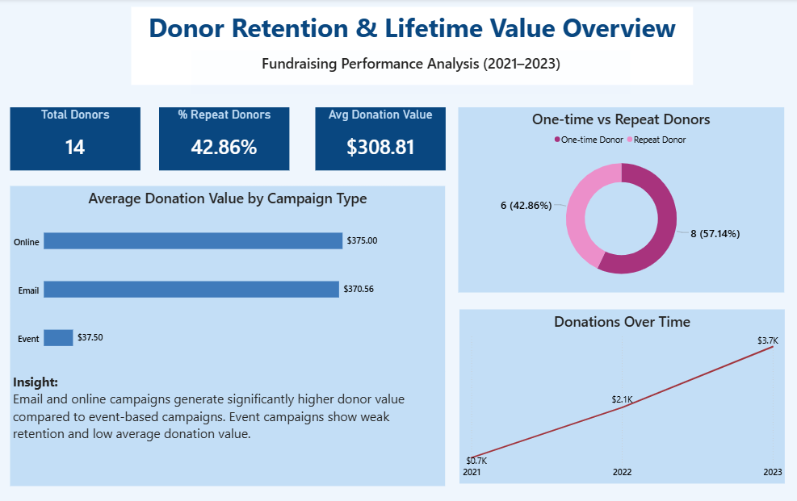

# Donor Retention and Lifetime Value Analytics

## Problem Statement

A fundraising organization has donation transactions across multiple campaigns but lacks visibility into donor retention, donor lifetime value (LTV), and the long-term effectiveness of different fundraising campaigns beyond total revenue. The objective of this analysis is to identify donor behavior patterns, measure long-term donor value, and evaluate campaign performance based on retention and lifetime value rather than short-term donation totals.

---

## Dataset Overview

The dataset consists of three core tables:
- **Donors:** Contains donor-level information such as signup date, donor type, and location.
- **Donations:** Transaction-level donation data including donation date, amount, and donor identifiers.
- **Campaigns:** Represents fundraising campaigns with campaign type and active time periods.

The data spans multiple years, enabling time-based retention and lifetime value analysis.

---

## Key Insights

### Donor Retention Overview

Analysis of donor transaction history shows that a majority of donors contribute only once. Approximately 57% of donors are one-time donors, while only 43% return to donate again. This indicates a significant retention drop after the first donation and highlights an opportunity to improve donor engagement strategies post-acquisition.

**Business implication:** Improving post-first-donation engagement could significantly increase donor lifetime value without increasing acquisition costs.

---

### Time to Second Donation

Among repeat donors, the time between first and second donation varies widely, indicating inconsistent post-acquisition engagement. Many donors take a long time to return, while others never donate again. This suggests there is a critical window after the first donation where timely follow-up and targeted communication could materially improve retention outcomes.

---

### Donor Lifetime Value (LTV)

Donor lifetime value remains largely flat within the first 3 and 6 months after acquisition. Most donors do not contribute additional value during this early period, with LTV growth primarily occurring closer to or after the 12-month mark. This pattern indicates that early-stage donor engagement strategies are underperforming and that meaningful value is generated only when donors remain engaged long term.

---

### Campaign-Level Donor Value

Campaign performance varies significantly when evaluated using donor lifetime value rather than total donations. Email campaigns acquire fewer donors than some other channels but generate the highest average 12-month donor lifetime value. In contrast, event-based campaigns produce the lowest average donor lifetime value, indicating weaker long-term donor engagement.

This demonstrates that campaign success should be measured not only by immediate revenue or donor volume, but by the long-term value of donors acquired through each channel.

---

## Tools Used

- PostgreSQL for data modeling and advanced SQL analysis  
- SQL window functions and CTEs for retention, timing, and LTV calculations  
- GitHub for project versioning and documentation  

---

## Business Recommendations

1. **Prioritize high-LTV acquisition channels:** Increase investment in email-based fundraising campaigns, as they consistently acquire donors with significantly higher lifetime value.

2. **Re-evaluate event-based fundraising strategies:** Event campaigns generate low long-term donor value and should be redesigned to include stronger post-event follow-up and retention initiatives.

3. **Strengthen early donor engagement:** Since LTV remains flat in the first six months, targeted onboarding, thank-you communications, and early re-engagement campaigns should be introduced shortly after the first donation.

4. **Measure success using long-term metrics:** Shift campaign evaluation frameworks away from one-time revenue and toward retention and lifetime value to support sustainable fundraising growth.

---

## Dashboard

A Power BI dashboard was created to provide an executive-level overview of donor retention, lifetime value, and campaign performance. The dashboard translates the SQL analysis into clear, decision-ready visuals for stakeholders.

### Dashboard Overview

